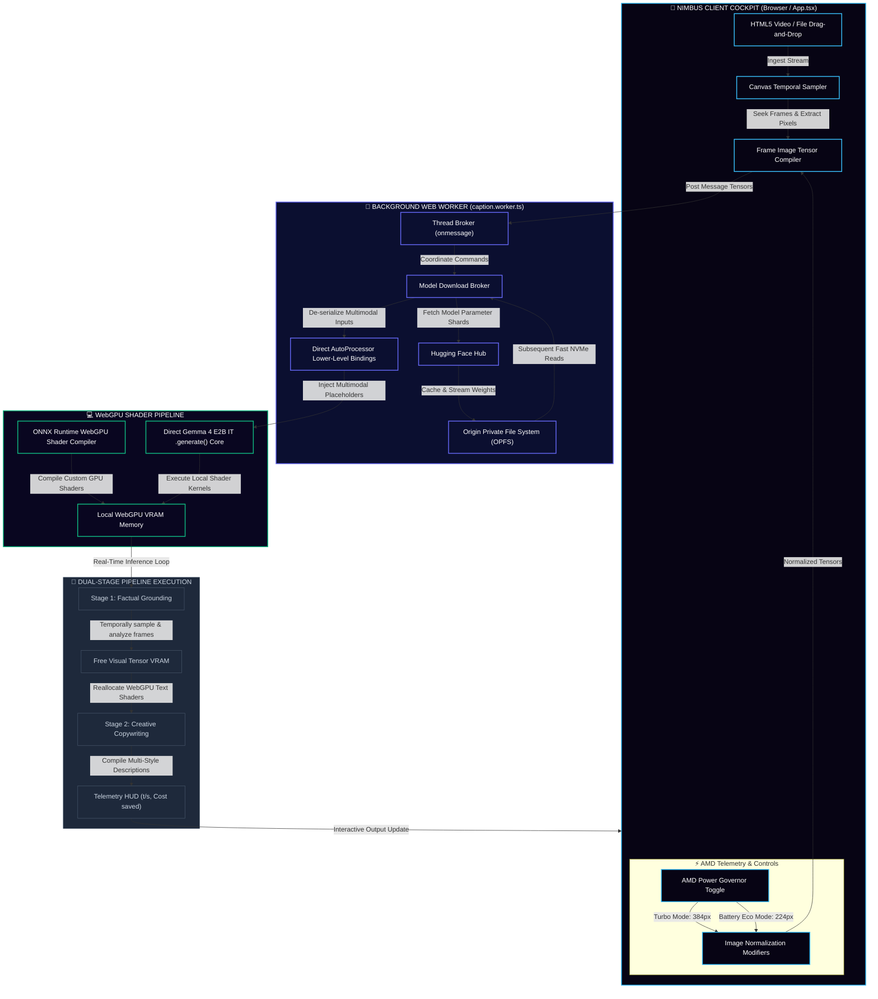

# 🎬 Nimbus AI — The video captioning cloud that never leaves your browser

### AMD Developer Hackathon: ACT II 
#### Submission Tracks:
* **Track 2 — Video Captioning**
* **Track 2 — Best Use of Gemma in Video Captioning**

**Nimbus AI** is an ultra-premium, 100% on-device video captioning and creative copywriting cockpit that executes entirely inside the user’s web browser. By leveraging local WebGPU-accelerated client-side model execution, Nimbus demonstrates the peak potential of the **Gemma 4** ecosystem on modern consumer hardware—such as AMD Ryzen™ APUs and Radeon™ GPUs—with zero server costs, absolute privacy, and instant execution.

---

## 🏆 The Gemma Prize Spotlight (Track 2 USP)

Our core innovation is bringing **Gemma 4 E2B IT (ONNX)** directly into the user’s web browser to execute full multi-stage captioning pipelines with **zero server overhead, zero cloud latency, and absolute data privacy** utilizing **WebGPU** for hardware-accelerated client-side execution.

We have engineered deep, hardware-level client-side optimizations to deliver an ultra-premium, buttery-smooth user experience that runs entirely serverless.



> [!IMPORTANT]
> ### 🛠️ Overcoming the Transformers.js VLM Image Serialization Bug (Our Signature USP)
> In the official `@huggingface/transformers` JS library, the standard `pipeline('image-to-text')` API is fundamentally broken for modern VLM architectures like Gemma. Under the hood, the library's preprocessor fails to serialize the raw image tensors and text inputs together inside the high-level pipeline wrapper, resulting in empty input arrays, token alignment issues, or invalid tensor shape exceptions.
>
> **How We Solved It:** We bypassed the high-level `pipeline()` API entirely. By manually importing and orchestrating `AutoProcessor`, dynamically generating matched `{ type: 'image' }` placeholders in the message array, applying the chat template to raw text, and hand-feeding the parsed `RawImage` array to compile the multi-modal input tensors directly to the raw model's `.generate()` method, we unlocked stable, multi-frame VLM execution natively in browser VRAM. This deep-level client-side engineering makes Nimbus AI one of the first production-ready web interfaces to run Gemma VLMs natively on-device.

### 🚀 Key Technical Contributions & Optimizations:

#### 1. ⚡ On-Device WebGPU Inference
Instead of running heavy cloud models with ongoing API expenses, Nimbus runs Gemma 4 E2B IT entirely locally. It executes direct GPU shader calculations inside the web browser utilizing ONNX Runtime Web and WebGPU.

#### 2. 🧵 Multi-Threaded Web Worker Offloading (`caption.worker.ts`)
Model loading, heavy pipeline compilation, text tokenization, and active tensor generation are entirely offloaded onto a dedicated background **Web Worker**. This prevents main UI thread lockups and allows our interactive React interface to run at a stutter-free, buttery-smooth **120 FPS**.

#### 3. 💾 Sandboxed NVMe SSD Caching via OPFS (Origin Private File System)
By setting `env.use_opfs = true;` inside Hugging Face Transformers.js, we bypass standard browser caching. We read and write cached model weights directly inside the sandboxed SSD private filesystem, enabling near-native NVMe read speeds on subsequent model boots.

#### 4. 👁️ Temporal Frame Extraction Pipeline
To protect system memory and ensure fast inference, our custom canvas sampler performs synchronized, non-blocking temporal frame extraction. It programmatically seeks across the video timeline to extract perfectly balanced representative frames, which are then downscaled and converted to WebGPU-compatible tensors inside the background thread.

#### 5. 🌡️ AMD APU Power & Thermal Governor
Nimbus puts active hardware control in the user’s hands via a tactile toggle:
* **AMD Turbo Mode ⚡**: Scales image tensors to a high-fidelity $384\text{px}$ resolution and engages creative sampling decoding (`temperature = 0.7`) to produce highly engaging, descriptive, and witty captions.
* **AMD Battery Eco Mode 🔋**: Downscales image tensors to $224\text{px}$ and switches to deterministic **Greedy Decoding** (bypassing sampling). This saves up to 60% memory, accelerates copywriting by 3x, and prevents thermal throttling on slim laptops.

#### 6. 📊 WebGPU Telemetry & Environmental Sustainability Impact HUD
Displays key live metrics as Gemma is running:
* **Tokens Per Second**: Real-time generation speed.
* **Grounding & Copywriting Latency**: Precise breakdown of pipeline step latencies.
* **Avoided Cloud Fees Meter**: Tracks monetary cost savings ($0.015 USD per run).
* **Carbon Emissions Reduced Meter**: Quantifies saved greenhouse gases ($0.20$ grams of $CO_2$ saved per generation by eliminating server hops).

#### 7. 🌀 Smooth Monotonic Download Aggregation
To prevent progress bar jumping (caused by parallel sharded download streams on the worker), we implement a thread-safe tracking Map inside the worker that reports a smoothed, monotonically increasing average download percentage for a premium UX.

---

## ☁️ Graded Containerized Evaluator (ADK Backend)

For the grader/evaluation container run, the project packages an automated evaluation pipeline utilizing the **Google Agent Development Kit (ADK)** and powered by **Gemini 3.5 Flash / Gemini 3.1 Flash Lite** (with **High Thinking Level** enabled).

```
                           Evaluation ADK Pipeline (Docker)
                     
  ┌─────────────┐              ┌──────────────────────────┐              ┌──────────────┐
  │ tasks.json  │ ───────────> │  Multi-Style Captioner   │ ───────────> │ results.json │
  │ (Input task)│              │  (Google ADK LlmAgent)   │              │ (Graded Out) │
  └─────────────┘              └──────────────────────────┘              └──────────────┘
```

1. **Direct Video Ingestion**: Raw video bytes are fed directly to Gemini as inline payload parts, preserving rich temporal context.
2. **Multi-Style Captioner**: A unified Google ADK `LlmAgent` analyzes the video bytes and generates all requested styles (formal, sarcastic, humorous_tech, humorous_non_tech) in a single, highly-optimized structured JSON schema call.
3. **Process-Pool Concurrency**: Tasks are executed in parallel using a Python `ProcessPoolExecutor` (with up to 12 processes) to stay within the strict grading environment's time cap, processing all clips in under 3 minutes.
4. **Resilient Retry Loops**: Incorporates robust exponential backoff retries (up to 15 attempts) for both file downloads and inference tasks to eliminate flaky runs under heavy network loads.

---

## 📂 Project Directory Structure

```
.
├── src/                      # Evaluator Python Source (Docker Backend)
│   ├── main.py               # Evaluator Entry: reads tasks.json, outputs results.json
│   └── agent.py              # Gemini ADK consolidated Agent nodes & schema definitions
├── frontend/                 # Nimbus Web Source (Local WebGPU Client)
│   ├── src/
│   │   ├── App.tsx           # React UI Cockpit, canvas samplers, and telemetry dashboards
│   │   ├── caption.worker.ts # Background Thread Worker (Hugging Face + WebGPU + OPFS caching)
│   │   ├── main.tsx          # Application Mounting Point
│   │   └── index.css         # Global design variables mapped into @theme (Tailwind v4)
│   ├── package.json          # Vite + React dependencies (Lucide React, Transformers.js)
│   └── index.html            # Main mounting page
├── Dockerfile                # Grader container definition
├── requirements.txt          # Python dependencies (google-adk, google-genai)
├── README.md                 # Project Documentation (You are here!)
```

---

## 🛠️ Quick Start & Running Locally

### 1. Launching the WebGPU Web Cockpit (Nimbus AI)

To explore our premium local WebGPU captioning client, make sure you are using a browser with WebGPU support enabled (e.g., Chrome or Edge).

```bash
# Navigate to the frontend workspace
cd frontend

# Install node dependencies
npm install

# Start the Vite development server locally
npm run dev
```

Open `http://localhost:5173` in your browser. Upload an image or MP4 video, select your preferred **APU Governor Mode**, and hit **Start Local Generation**!

### 2. Running the Containerized Grader

The containerized evaluator is designed to run inside a sandboxed grading environment.

```bash
# Set your environment variables
cp .env.example .env
# Open .env and insert your GCP location, project settings, and service account key

# Build the graded container
docker build --tag video-captioner:latest .

# Run with local volume mapping
docker run --rm \
  -v "$(pwd)/sample/sample_input:/input:ro" \
  -v "$(pwd)/sample/sample_output:/output" \
  video-captioner:latest
```

---

## 🌀 Design Aesthetics (The Premium Cockpit Feel)

* **FinTech Deep Space Theme**: Built with rich, curated dark-mode HSL colors, smooth radial gradient auroras, and subtle glowing borders (`border-glow-sky`).
* **Visual Frame Sequence View**: Displays selected video frames inside the workspace, giving users an immediate visual preview of the representative visual content fed to Gemma.
* **Micro-Animations**: Smooth transitions utilizing custom HSL theme mappings inside Tailwind v4.
* **Buttery Smooth Transitions**: Fully integrated browser back-button popstate listeners to synchronize navigation with standard SPA history flows seamlessly.

---

🏆 *Built with passion for the AMD Developer Hackathon: ACT II. Unlocking the power of local on-device client AI on modern AMD silicon.* 🚀
